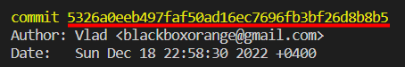

# Инструкция для работы с Git

Git - это консольная утилита, для отслеживания и ведения истории изменения файлов, в вашем проекте. Чаще всего его используют для кода, но можно и для других файлов.

##  Актуальную версию Git можно найти [здесь](https://git-scm.com/book/en/v2/Getting-Started-Installing-Git). 

 

### Блок1. Базовые функции:

* git init - инициализация локального репозирория

* git status - получить информацию о текущем состоянии репозитория

* git add info.md - добавляет отслеживание файла info.md

* git add . - добавляет отслеживание всех файлов в директории {обязательно пробел после add}

* git commit -m "comment" - фиксация состояния

* git log - вывод истории всех коммитов с хеш-кодами

   

   *Это хэш-код. Для перехода достаточно использовать первые четыре знака.*

* git checkout - переход от одного коммита к другому

* git checkout master - переход к актуальному состоянию файла

* git diff - показать разницу между актуальным файлом и последним коммитом

 
-------------------------------------------------------------------------------------------------
 

 ***Ну, и секрет названия словами автора:***

>	I'm an egotistical bastard, so I name all my projects after myself. First Linux, now git.
 

-------------------------------------------------------------------------------------------------
### Блок 2. Функции работы с ветками:

+ git branch -m старое_название_ветки новое_название_ветки - переименовать ветку

+ git branch - посмотреть список веток в репозитории

+ git checkout <название ветки> - переход к другой ветке

+ git branch -d <название ветки> - удалить ветку

+ git merge <название ветки> - слияние указанной ветки с текущей

### Блок 3. Функции для удаленного репозитория

+ git clone <url-адрес репозитория> – клонирование внешнего репозитория на  локальный ПК
+	git pull – получение изменений и слияние с локальной версией
+	git push – отправляет локальную версию репозитория на внешний

